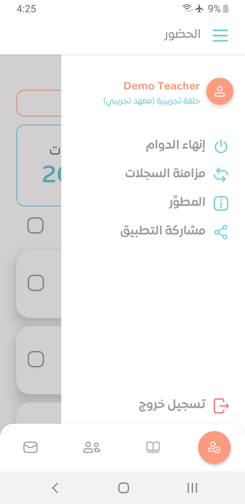
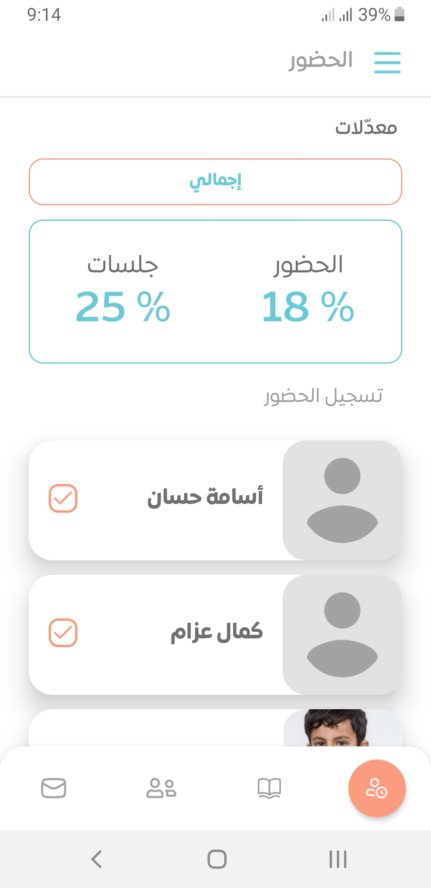
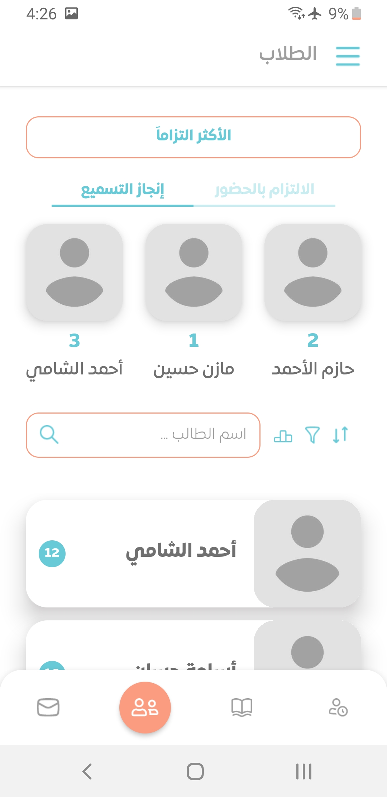
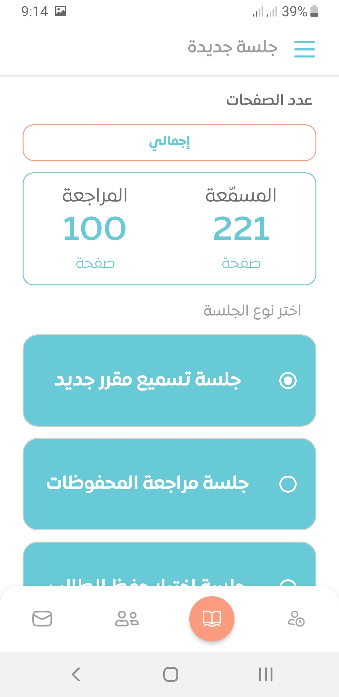
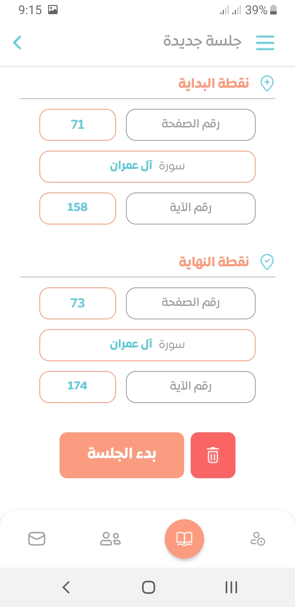
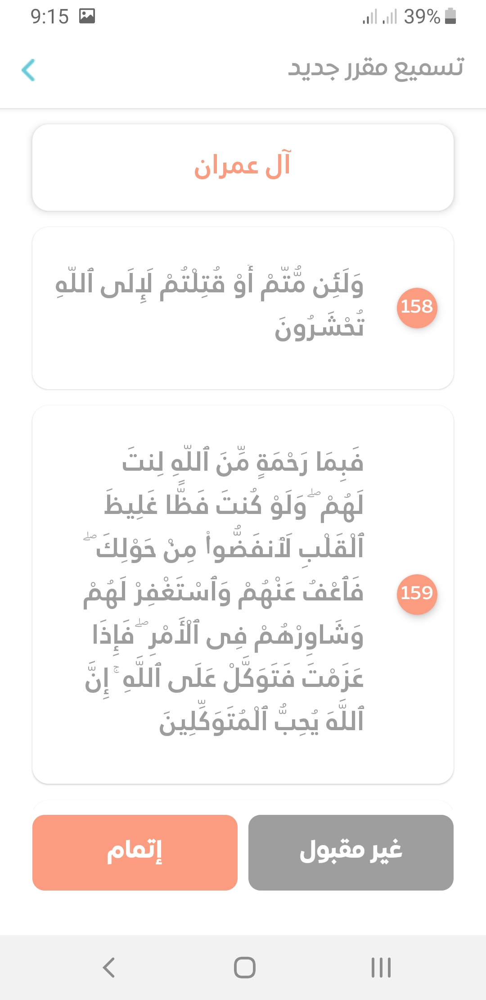

# Ehkam App (Android)

<div style="display: flex; justify-content: space-around; margin-bottom: 20px">

</div>

> 🏗🚧 <ins>**Note**</ins>: This project is currently being prepared for public release as open-source software that can be used by any Quran school as it's currently linked to the main server. It is published for showcasing purposes. For any inquiry feel free to reach me out hamzakattan@outlook.com

Ehkam App is a Quran teaching assistant built using React Native. It is a part of a Ehkam system that's made for Quran schools management.

<div style="display: flex; justify-content: space-around; margin-bottom: 5px">
  
  
  
</div>

<div style="display: flex; justify-content: space-around; margin-bottom: 5px">
   
  
  
</div>
  
</div>

## Key Features

1. **Attendance Tracking**: Easily monitor your students' attendance. The app provides a detailed overview of each student's attendance record, displaying the percentage of sessions attended and missed. Stay informed and ensure your students are consistent with their studies.

2. **Session Management**: Effortlessly create and manage new study sessions. Specify the starting and ending points by entering the page number, Surah, and Ayah. Our intuitive interface allows you to set up sessions quickly, enabling you to focus on teaching.

3. **Progress Monitoring**: Evaluate your students' recitations accurately. After each session, review and mark their progress as accepted or needing improvement. This feature helps you identify areas where students may require additional support and track their memorization journey effectively.

4. **Student Profiles**: Maintain detailed profiles for each of your students. Easily access information on their attendance, session history, and progress. This personalized approach allows you to tailor your teaching methods to each student’s needs.

## Tech Stack

- Typescript
- React Native
- Mobx State Tree
- React Navigation

## Demo Login

Use the following login details to try the teacher experience.

- **Email**: demo_t@ehkam.app
- **Password**: DEMoDEMo

## Setup Development Environment

First, you should have `node` => v. 16.14.0 and `yarn` installed. To install all dependencies and stuff run:

```
yarn
```

### Run Emulator

**React Native Metro**

```
yarn android
```

If the emulator doesn't work properly, see the troubleshooting section below.

**Expo**

```
yarn expo:android
```

NOTE: Expo emulator is not working properly because some components like FastImaage doesn't support it, so use the React Native Metro instead.

### Build

1. `cd android`
2. Run `./gradlew clean`
3. Build the Bundle: Go back to the root direectory `cd ..` then `react-native bundle --platform android --dev false --entry-file index.js --bundle-output android/app/src/main/assets/index.android.bundle --assets-dest android/app/src/main/res` It creates the `index.android.bundle` named bundle file in assets folder.
4. Build the package:
   1. Option 1 (APK): `cd android` then `./gradlew assembleRelease -x bundleReleaseJsAndAssets` it will gives you the release **APK** at `android\app\build\outputs\apk\release` location.
   2. Option 1 (AAB): `cd android` then `./gradlew bundleRelease -x bundleReleaseJsAndAssets` it will gives you the **AAB** file of your project.

### Troubleshooting

If you face any issue while running the emulator or building the app, try the following:

1. Run `npm cache clean --force`
2. Run `git clean -fdx`
3. Back to the project root, and run `yarn`
4. `cd android` and run `./gradlew clean`
5. If the emulator doesn't work properly: Go to the AVD in the Android Studio and wipe the data of the emulator
6. Reboot the PC
7. Try to build now

## TODOs

- [ ] Add dev guide on:
  - [ ] Customized setup
  - [ ] Backend setup
- [ ] Add dev documentation on:
  - [ ] App archeticture
  - [ ] Implementing new feature

## Credits

UI designs are made by [Qurtas Studio](https://www.behance.net/Qurtas-Studio)
